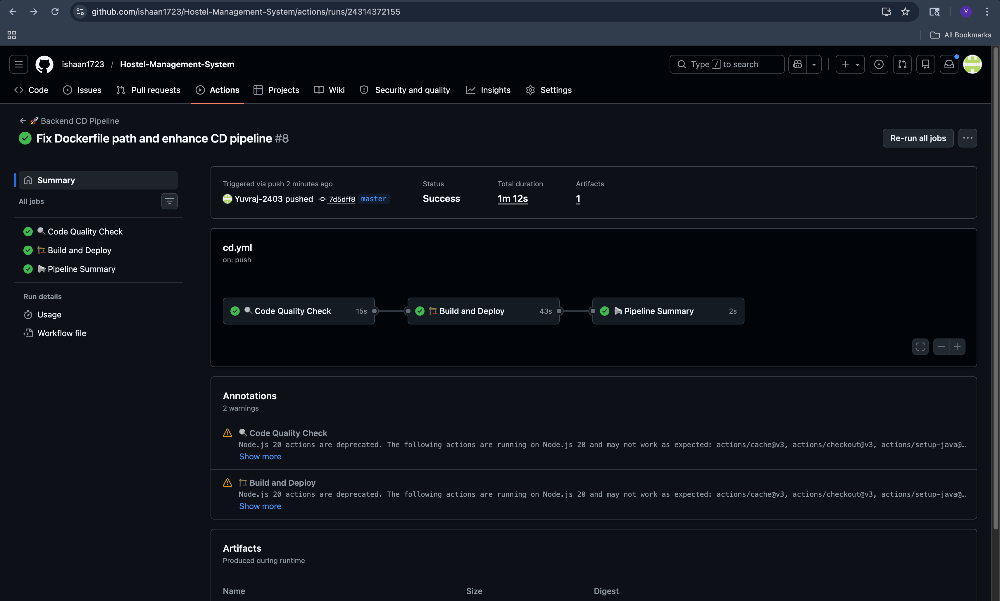
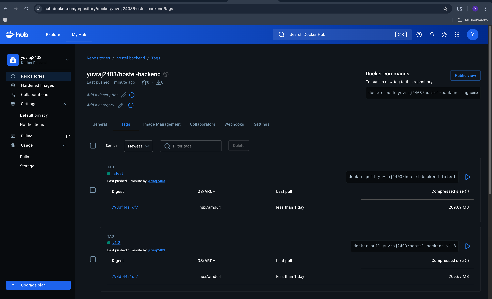
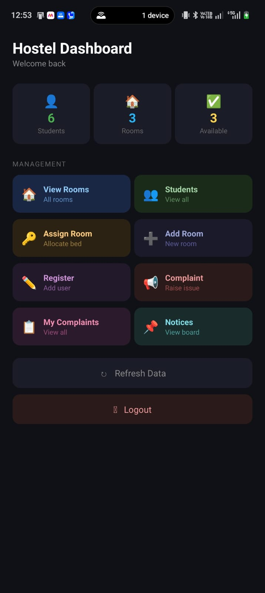

# Hostel Management System

##  Problem Statement
Managing hostel operations manually is inefficient and error-prone.
This system automates room allocation, student registration, 
complaints, and notices through a Spring Boot backend and Android app.

---

## Architecture
Android App (Kotlin)
↓
Retrofit API
↓
Spring Boot Backend
↓
MySQL Database

---

##  Team Contributions

| Member | Work Done |
|---|---|
| ISHAAN JAIN | Android Frontend Development and Backend |
| Yuvraj Singh | DevOps - CI/CD Pipeline and Docker |

---

## Git Workflow

| Branch | Purpose |
|---|---|
| `master` | Production ready stable code |
| `feature/devops-enhancement` | CI/CD pipeline and Docker setup |

---

##  CI Pipeline (ci.yml)

- Triggers on push and pull request to master
- Sets up Java 17 with Temurin distribution
- Caches Maven dependencies for faster builds
- Builds project using Maven
- Runs unit tests
- Uploads JAR as build artifact

---

##  CD Pipeline (cd.yml)

- Triggers on push to master
- Checks code quality using Checkstyle
- Builds JAR file using Maven
- Uploads versioned JAR artifact
- Builds Docker image
- Pushes Docker image to Docker Hub
- Shows final pipeline summary

---

## Docker Deployment

- Docker image automatically built and pushed via CD pipeline
- Image Name: `Yuvraj2403/hostel-backend:latest`
- Versioned Image: `Yuvraj2403/hostel-backend:v1.x`

---

## GitHub Secrets Used

| Secret | Purpose |
|---|---|
| `DOCKER_USERNAME` | Docker Hub username |
| `DOCKER_PASSWORD` | Docker Hub password |
| `DB_URL` | MySQL database URL |
| `DB_USERNAME` | MySQL username |
| `DB_PASSWORD` | MySQL password |

---

## Maven Cache Optimization

- Maven dependencies cached using actions/cache@v3
- Cache key based on pom.xml hash
- Reduces build time on every pipeline run
- Cache hit status displayed in pipeline logs

---

##  Tools Used

| Tool | Purpose |
|---|---|
| Spring Boot | Backend REST API |
| MySQL | Database |
| Android Kotlin | Mobile Frontend |
| Retrofit | API calls from Android |
| GitHub Actions | CI/CD Pipeline |
| Docker | Containerization |
| Maven | Build tool |
| Git | Version control |

---

## Features

- Student Registration
- Warden Management
- Room Allocation
- Complaints Management
- Notice Board
- Search Students
- Pull to Refresh
- Student Count Display

---

## How to Run

### Backend
```bash
cd Backend
./mvnw clean install
./mvnw spring-boot:run
```

### Android
Open project in Android Studio
Run on emulator or physical device

---

## Challenges Faced

- Fixed Retrofit double baseUrl bug
- Configured Android cleartext traffic for local API calls
- Resolved GitHub Actions Maven permission issue
- Optimized pipeline with Maven dependency caching

---

## Screenshots

### CI Pipeline Success
![CI Pipeline]docs/CI PIPELINE SUCCESS.png

### CD Pipeline Success


### Docker Hub Deployment


### App Screenshot

